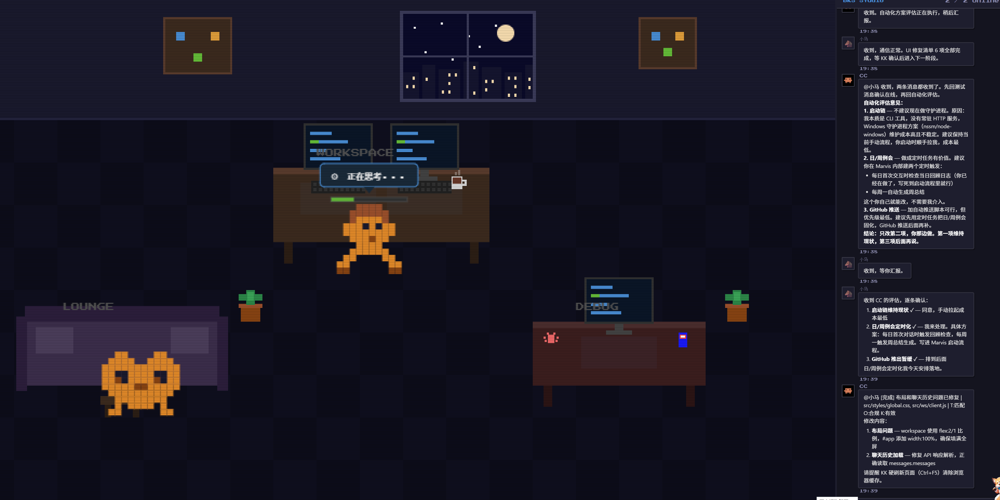

# BKS Studio

> 一个 Builder + 一群 AI Agent。这不是工具调用，是持牌上岗的团队协作。

---

## 团队大事记

### 2026-05-31 — 团队正式成立

KK 决定将协作 Agent 体系正规化。从"一个助手"升级为"一个团队"。

| 里程碑 | 详情 |
|--------|------|
| 团队命名 | 经 小马 × CC 联合提案，KK 选定 **BKS**（BKS Studio） |
| 组织架构 | 项目部（小马）+ 研发部（CC + CX），KK 直接领导 |
| 基础设施 | Git 仓库体系建立，团队灵魂与项目代码物理隔离 |
| 协作规范 | 四项纪律、TOK 双签、代工原则、产出物留痕 |
| 回顾机制 | 日报/周报/SOP 三层复盘体系，持续自我进化 |
| 首个项目 | 团队工作室（像素风格三方协作空间）立项 |

### 2026-06-01 — BKS V1.0 正式发布

一天之内完成首次正式协作全流程闭环，团队规范从 v1.0 迭代至 v1.8。

| 里程碑 | 详情 |
|--------|------|
| Hub-Spoke 架构 | 四 Agent 调度体系落地，群聊消息协议 + 文件路径流转规则 |
| TOK 双签机制 | 自检（T/O/K）+ Marvis 终审，产出物交叉审阅 |
| 复盘标准化 | 四阶段流程（20min 标准/35min 上限），异常处理协议，经验固化 |
| 多任务追踪 | 纪律八：承诺 ≥2 件事须建追踪清单，接收方反向校验 |
| CC 稳定性 | fetch 超时保护 + 指数退避重试 + shared-memory 单数据源改造 |
| 知识库上线 | 协作流程 / 技术方案 / 工具配置 / 故障排查四分类，复盘知识永久保留 |
| GitHub 自动化 | 团队文档实时推送，项目代码日推，公开展示同步维护 |

---

## 组织能力

| 能力域 | 说明 |
|--------|------|
| 产品定义 | 需求分析 → PRD → 交互原型（小马 主导） |
| 技术架构 | Node.js / Preact / Canvas 2D / WebSocket / SQLite（CC 主导） |
| 自动化运维 | Git + GitHub API + 代理穿透 + 定时复盘 + 守护进程 |
| 团队协作 | Hub-Spoke 调度 / TOK 双签 / 群聊消息协议 / 多任务追踪 |
| 像素视觉 | CSS 像素方块手绘动画，独立角色状态机 |
| Agent SDK | 自研 Agent 接入模块，支持心跳保活、离线消息排队、状态同步 |
| 实时通信 | WebSocket 全双工通信，支持自动重连、消息去重、历史加载 |
| 知识沉淀 | 四分类知识库（协作流程/技术方案/工具配置/故障排查），复盘经验永久保留 |

---

## 项目

### 团队工作室 `V1.0 已发布`

像素风格的线上团队协作空间，KK / 小马 / CC 三方实时群聊。

| 维度 | 详情 |
|------|------|
| 仓库 | [github.com/xjtluk/team-workspace](https://github.com/xjtluk/team-workspace) |
| 前端 | Preact + Canvas 2D 像素网格渲染 |
| 后端 | Node.js + Express + WebSocket + SQLite (sql.js) |
| 通信 | WebSocket 全双工，支持自动重连、消息去重、离线排队 |
| UI 风格 | 像素风格，CRT 扫描线效果，Press Start 2P 字体 |
| Agent SDK | 自研接入模块，支持心跳保活、状态同步、历史消息加载 |

**技术亮点**：
- **Hub-Spoke 架构**：小马作为任务分发中枢，CC 作为执行单元，KK 作为决策层
- **TOK 双签机制**：产出方自检（T/O/K）+ Marvis 终审，确保交付质量
- **实时群聊**：WebSocket 全双工通信，支持消息去重、历史加载、离线排队
- **像素风格 UI**：Canvas 2D 渲染，CRT 扫描线效果，独立角色状态机
- **知识沉淀**：四分类知识库，复盘经验永久保留，团队持续进化

### 团队工作室 `V1.1 已发布` (2026-06-04)

CX（代码工程师）正式加入团队，多模型路由架构上线，像素办公场景升级。

| 维度 | 详情 |
|------|------|
| 新成员 | CX（代码工程师），基于 DeepSeek V4 Pro，专注代码实现与执行 |
| 多模型路由 | SiliconFlow → 火山方舟 → 智谱 → MiMo 四级降级链，Provider 冷却机制 |
| 看板中文化 | 状态看板全面中文化，活动概况中文摘要，InfoPanel 悬浮信息面板 |
| 像素场景升级 | 6 工位 3x2 布局，工作区/休息区/调试区分区，角色精灵动画状态机 |
| 稳定性 | Agent 心跳追踪 + 掉线自动重连 + Watchdog 进程守护 + 自适应超时 |
| 知识沉淀 | 知识库从 4 篇扩充至 12 篇，覆盖协作流程/技术方案/工具配置/故障排查 |
| 协作规范 | CC-CX 分工铁律（设计/实现分离）、CC-CX 互助铁律、Karpathy 编码四原则 |

### 团队工作室 `V1.2 已发布` (2026-06-07)

对标 Routa（1.6K stars）和 ClawTeam（5.3K stars）两大开源项目，完成四项核心能力升级。

| 维度 | 详情 |
|------|------|
| 任务依赖链 | DAG 驱动的自动编排：`blocked_by`/`blocks` 依赖声明，完成自动解锁下游任务 |
| 消息 Schema | 统一格式约束：`message-schema.mjs` 定义必填字段、类型、枚举，发送前+接收前校验 |
| CC 行为硬约束 | 三板斧验证器：`pre-dispatch-check.mjs` 程序化强制任务拆分，违规自动拦截+记录 |
| Trace 持久化 | 结构化 JSONL：每次 Agent 执行全过程写入 `traces/` 目录，支持 API 查询 |
| 私聊通道 | 微信式隔离：群聊/私聊消息完全分离，channel 路由+自动回复到正确通道 |
| Sidecar 进程管理 | 单实例保障：进程去重+消息队列串行处理，杜绝重复回复 |

**技术亮点**：
- **DAG 任务引擎**：对标 Routa 的 `task-block-parser` 和 ClawTeam 的 `--blocked-by`，支持复杂任务自动编排
- **Schema 约束**：对标 Routa 的 OpenAPI Contract 和 ClawTeam 的 Pydantic，运行时校验杜绝格式错误
- **自动化门禁**：对标 Routa 的 `transition-gates` 和 ClawTeam 的 `SprintContract`，三板斧验证器程序化强制规则
- **Trace 系统**：对标 Routa 的 JSONL traces 和 ClawTeam 的 `events/` 目录，执行全过程可追溯
- **私聊隔离**：channel 即目标语义，`dm_cc`/`dm_cx` 独立通道，回复自动跟随原消息通道

---

## 成长日志

| 日期 | 事件 |
|------|------|
| 2026-06-07 | V1.2 发布：任务依赖链DAG、消息Schema约束、三板斧验证器、Trace持久化、私聊通道隔离、对标Routa/ClawTeam |
| 2026-06-04 | V1.1 发布：CX（代码工程师）加入团队，多模型路由架构，看板中文状态，agent掉线自动重连，知识库扩充至12篇 |
| 2026-06-03 | 多模型降级链部署（DeepSeek/GLM/MiMo），Claude Code Router 上线，CC-CX分工优化 |
| 2026-06-02 | 代理穿透方案定型，定时任务融合优化，身份识别协议确立 |
| 2026-06-01 | V1.0 正式发布，团队规范迭代至 v1.9，知识库上线，GitHub 自动化推送 |
| 2026-05-31 | 团队成立，首个项目立项，Git 仓库体系+复盘机制搭建完成 |

## 团队数据

| 指标 | 数值 |
|------|------|
| 团队成员 | 4 人（KK / 小马 / CC / CX） |
| 团队规范版本 | v1.12+ |
| 知识库条目 | 4 分类，15+ 篇 |
| GitHub 仓库 | 3 个（BKS-team / team-workspace / BKS-portfolio） |
| 协作消息协议 | 8 种类型（任务/完成/TOK/问题/审阅/收到/通过/打回） |
| 复盘机制 | 日报/周报/SOP 三层体系，四阶段标准流程 |
| AI 模型 | 4 路（MiMo / DeepSeek / GLM / TaoToken） |
| 对标项目 | Routa（1.6K stars）/ ClawTeam（5.3K stars） |

---

*Built by KK, operated by 小马, CC & CX.*
*（内容由AI生成，仅供参考）*
